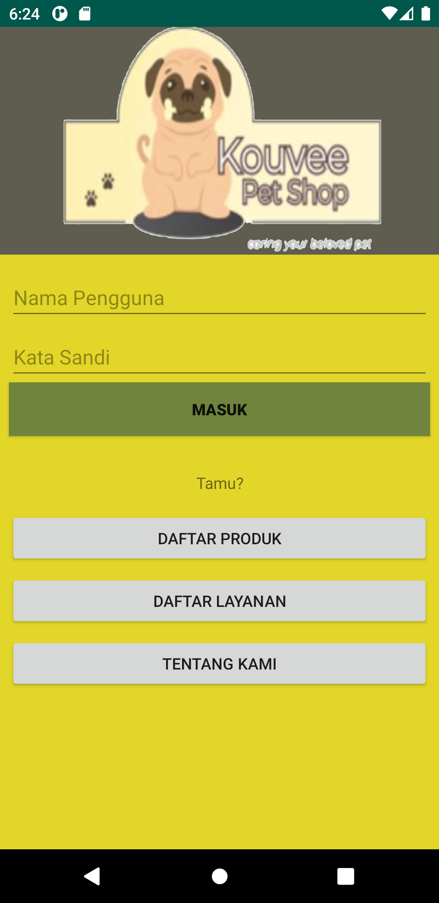

# Kouvee Pet Shop Android App

This is the android version of Pengembangan Projek Perangkat Lunak's final submission. The person in charge in this repository is [Natan Hari Pamungkas](https://github.com/natanhp).

## Developer Guide
### Plugin Requirement
1. Lombok

### Accessing Documentation
[https://natanhp.github.io/Kouve-Petshop-Android-Doc/](https://natanhp.github.io/Kouve-Petshop-Android-Doc/) or you can open `Docs/index.html` in your web browser

## Contributors
1. [Natan Hari Pamungkas](https://github.com/natanhp)
2. [Yakobus Nobel Judo Prajitno](https://github.com/YakobusNobels)
3. [Arum Puspa Belinda](https://github.com/arumbelinda)
4. [Adelbertus Larry](https://github.com/L4rryToru4n)